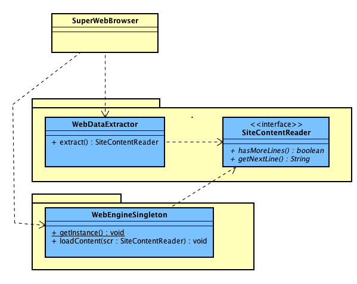

##Escuela Colombiana de Ingeniería

###Procesos de Desarrollo de Software - PDSW
####Ejercicio - Patrones estructurales

##### Trabajo individual o en parejas

##### Entregables

* Diseño de la solución (impreso): en la clase del martes.
* Implementación: antes del próximo laboratorio.


Se le ha dado acceso a los fuentes de un nuevo navegador Web llamado 'Super-Web Browser'. Éste aún está en fase experimental, por lo que aún no carga correctamente algunas páginas (en especial las que tengan hojas de estilo).


Este navegador Web depende de una serie de componentes desarrollados por la organización 'darkweb', sobre los cuales usted no tiene acceso (se tienen como dependencia de Maven):



```javascript
mvn compile
mvn exec:java -Dexec.mainClass="co.edu.eci.webbrowser.SuperWebBrowser"

```

La tarea que se la encomendado es, aplicando patrones estructurales, lograr que el navegador maneje diferentes mecanismos de filtrado de contenidos, pensando en diferentes perfiles:

* Filtrado en línea para niños. Cuando se carga un contenido de la red, palabras como 'bomba', 'explosivo', y 'violencia' son reemplazadas por asteriscos (el resto del contenido será presentado tal cual).
* Filtrado para empresas. Cuando se carga un contenido que contenga más de N veces la palabra 'juego', 'apuesta', 'piratería', NO se carga ningún contenido de la página. En su lugar, se le dará como contenido el texto de los primeros párrafos de [ésta página](http://personalylaboral.com/procrastinacion/).

Tenga en cuenta que estos dos mecanismos de filtrado son excluyentes entre sí, pues están pensados para diferentes tipos de público. Por esta razón, el software debe poderse configurar para usar una de estos dos mecanismos (a través de archivos de configuración o de la interfaz de usuario). Por otro lado, su solución debe considerar el principio Abierto/Cerrado, de manera que sea posible agregar nuevos mecanismos de filtrado sin tener que modificar el código base. Para esto, vale la pena tener en cuenta el principio de Inversión de Dependencias, y patrones creacionales como [Factory Method](https://sourcemaking.com/design_patterns/factory_method).

## Criterios de evaluación

1. Correcta identificación del patrón estructural aplicable.
2. Correcta implementación del patrón estructural aplicable.
3. Adaptabilidad de la solución: principio Abierto/Cerrado, aplicación de patrones creacionales.