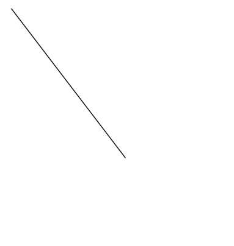
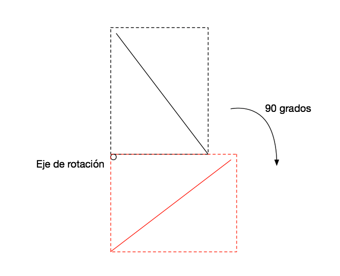
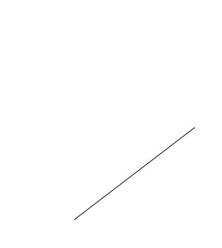

###Escuela Colombiana de Ingenieria
###Procesos de desarrollo de Software - PDSW


__Taller - diseño de pruebas: clases de equivalencia, condiciones de frontera, análisis de transiciones.__

Entregables: 

* Parte I, en clase.
* Parte II (clases de equivalenci y diseño). El martes clase.
* Parrte II (implementado). Antes del próximo laboratorio.

###Parte I

1. Descargue e importe el proyecto de base del primer punto.

	```bash
git clone https://github.com/PDSW-ECI/DesignPatterns_Behavioral_Command_TestingIntro.git
```


2. Revise cómo es la estructura de Maven para separar las pruebas de los demás artefactos del proyecto: src/main, src/test.
3. Ejecute la fase de pruebas del proyecto con el comando, y analice cómo son presentados los resultados.

	```
mvn test
	```
4. Implemente un caso de prueba para cada clase de equivalencia/condicion de frontera identificado. Recuerde usar la anotacion @Test y seguir la conveción de nombres: 

	```java
/**
* Pruebas clase de equivalencia XX: [Aquí la especificación de la clase de equivalencia]
**/
@Test
public void testClaseEquivalenciaXX(){
	...
}
	```

5. Una vez implementadas las pruebas, haga la implementación que ya hizo un 'programador poco confiable', en el archivo algoritmo-ProgramadorPocoConfiabe.txt.
6. Ejecute las pruebas. A partir de los resultados obtenidos, identifique los posibles problemas que tenga la implementación.
7. Hága el análisis de cobertura de sus pruebas, mediante el comando:
	
	```
mvn cobertura:cobertura
	```
	y posteriormente revisando el reporte en target/site/cobertura/. A partir de esto, identifique casos de prueba adicionales para que el cubrimiento de saltos mejore (ojalá al 100%).


###Parte II.
####Parte A.


En este ejercicio, va a agregar un par de requerimientos funcionales a una herramienta de dibujo tipo CAD, siguiendo un esquema TDD (Test-Driven development). En la evaluación se revisará que efectivamente se hayan hecho las pruebas antes de la implementación.

1. Clone los fuentes de ESTE repositorio con git, NO lo descargue directamente de la página!).


2. Importe el proyecto y revise su funcionalidad. Como observará, la opción 'rotar figura seleccionada' no está implementada aún. Esta función permite rotar la figura seleccionada actualmente en la lista de figuras, usando como eje de rotación la esquina inferior izquierda del rectángulo que enmarque dicha figura (por ahora sólo se pueden dibujar líneas y rectángulos).

Por ejemplo, si la siguiente fuera la figura seleccionada:
 


Al seleccionar la opción de rotación se haría:
	


Quedando al final:



Revise la especificación del método 'rotateSelectedShape' y a partir del mismo haga lo siguiente:
	
* Defina las clases de equivalencia para las posibles entradas de este método. Ponga el detalle de estas clases, a manera de comentarios, en la clase de pruebas ControllerTest.
* Seleccione un caso por cada clase de equivalencia e implemente las respectivas pruebas en ControllerTest.

* Cuando haya hecho lo anterior, ejecute:
	
```bash		
git add .			
git commit -m "primera versión de las pruebas"
			
```		
		
* Haga la implementación del método 'rotateSelectedShape', y apoyese en las pruebas (mvn test), para verificar la funcionalidad del mismo.
* Una vez tenga la funcionalidad deseada, realice las pruebas de cubrimiento para rectificar que las pruebas están contemplando todos los caminos/condiciones del método implementado.
* Una vez se tenga la funcionalidad implementada, haga un nuevo commit:
	
```bash		
git add .			
git commit -m "funcionalidad mirror implementada"
			
```		


####Parte B.

Otra funcionalidad faltante es la opción de 'deshacer' / 'rehacer'. Para esto, aplique el patrón Comando (ver referencia dada en la programación de lecturas).

Tenga en cuenta que para lograr esta funcionalidad se requiere:

1. Encapsular en 'Comandos' las funcionalidades de:

	* Dibujar una figura
	* Duplicar
	* Rotar la figura seleccionada

2. Embeber en dichos comandos las respectivas operaciones inversas. Por ejemplo, el inverso de dibujar una figura es eliminarla, mientras que el inverso de duplicar, será borrar todas las figuras adicionales creadas.

3. Mantener, con un esquema de pilas, tanto la secuencia de comandos ejecutada, como la secuencia de comandos 'deshecha', de manera que las operaciones de 'deshacer' y 'rehacer' se hagan en un orden lógico.


Nota: Para comprimir el avance en un archivo .zip, use el comando (dentro del directorio que va a comprimir, sin olvidar el punto):


```bash	
	zip -r NOMBRE.PROYECTO.zip .	
```			


###Criterios de evaluación

Parte I.

* Se modificó el código hecho pro el 'programador poco confiable', corrigiendo el error existente en el mismo.

Parte II.

* Proceso:
	* Se especificaron clases de equivalencia y condiciones de frontera para las pruebas del método 'mirror', a partir de la especificación (dicha especificación debe estar como comentarios en la clase que implementa las pruebas).
	* Las clases de equivalencia deben describir conjuntos NO UNITARIOS, es decir NO deben hacer referencia a conjuntos de valores concretos (estos serían casos de prueba, no clases de equivalencia).
	* Se describen condiciones de frontera (igualmente, sin hacer referencia a valores concretos).
	* Se implementaron casos de prueba acordes con las clases de equivalencia.
	* Al revisar los LOGs de GIT, se evidencia que primero se hicieron las pruebas, y luego la implementación del código.
	
* Diseño:
	* Se creó un conjunto de comandos que encapsulan la funcionalidad de dibujar, duplicar y espejo. Cada comando incluye un método con la operación inversa, de manera que con ésta se puedan deshacer las operaciones.
	* La aplicación lleva el historial de los comandos ejecutados, de manera que se puedan realizar las operaciones de deshacer/rehacer consistentemente. Nota: el incluír pilas dentro de los comandos (y hacer el apilar/desapilar dentro de la ejecución de los mismos), se evaluará como R, pues esto acopla dichos comandos a la funcionalidad de deshacer/rehacer.
	* En el esquema de deshacer/rehacer se debe tener en cuenta que si después de deshacer una acción, se crea una nueva acción (un nuevo comando), el 'rehacer' debe quedar invalidado.		

* Funcionalidad:
	* La aplicación permite dibujar, duplicar y hacer espejo de manera consistente.
	* Las operaciones se pueden deshacer/rehacer.
